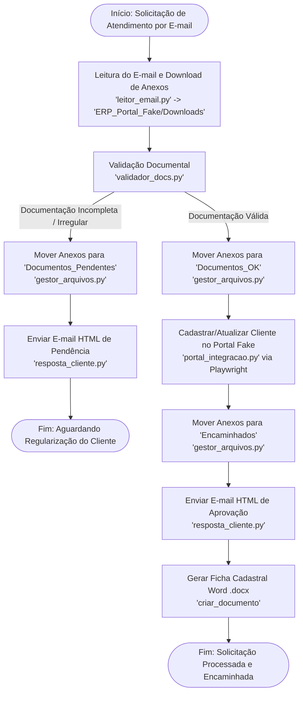

# 📜 Relatório Técnico - Automação do Processo 1 (Setor de Atendimento)
**Empresa Portal Fake | Roteiro 10 - Disciplina de Técnicas de Hyperautomation**
**Professor:** Prof. Moisés Levy

---

## 👥 1. Identificação da Equipe e Responsabilidades

* **Integrante 1:** Responsável pela Modelagem BPMN (`Processo01_Atendimento.drawio`), Módulo de Leitura de E-mails (`leitor_email.py`), Validador Documental (`validador_docs.py`) e Integração Playwright com Portal Fake (`portal_integracao.py`).
* **Integrante 2 (Sannyer Carvalho):** Responsável por Gestão de Versões (GitFlow), Estruturação das Pastas ERP (`ERP_Portal_Fake`), Gestor de Arquivos (`gestor_arquivos.py`), Notificador Transacional HTML (`resposta_cliente.py`), Orquestração Integrada (`orquestrador.py`) e Redação do Relatório Técnico.

---

## 🗺️ 2. Modelagem do Processo em BPMN 2.0

O **Processo 1 (Setor de Atendimento)** foi modelado visualmente no Draw.io (`docs/Processo01_Atendimento.drawio`) e segue a especificação BPMN 2.0.

### Diagrama do Fluxo de Atendimento:


---

## 🛠️ 3. Arquitetura da Solução e Estrutura de Pastas

A arquitetura adota o padrão **Modular por Processo**, separando as responsabilidades em submódulos reutilizáveis:

```text
hyperautomation-equipe-1/
├── ERP_Portal_Fake/                  # Estrutura do ERP Simulado (Pastas Físicas)
│   ├── Downloads/                    # Entrada de anexos baixados dos e-mails
│   ├── Documentos_OK/                # Documentos validados e aprovados
│   ├── Documentos_Pendentes/         # Documentos com inconsistências ou ausentes
│   └── Encaminhados/                 # Documentos processados e cadastrados no portal
├── docs/                             # Documentação do Projeto
│   ├── Processo01_Atendimento.drawio # Diagrama BPMN 2.0 no Draw.io
│   └── relatorio_tecnico_processo1.md# Este relatório técnico
└── HyperAutomation/                  # Módulos Python e Orquestração
    ├── source/
    │   ├── .env                      # Variáveis de ambiente (Credenciais SMTP/IMAP e ERP)
    │   ├── orquestrador.py           # Orquestrador do fluxo completo (Processo 1)
    │   ├── common/                   # Módulos reutilizáveis (extração e geração docx)
    │   │   ├── documento_email.py
    │   │   └── extracao.py
    │   └── processo_atendimento/     # Módulos do Processo 1
    │       ├── __init__.py
    │       ├── gestor_arquivos.py    # Movimentação física no ERP
    │       ├── resposta_cliente.py   # Notificações de e-mail em HTML
    │       ├── leitor_email.py       # Leitura IMAP e extração de anexos
    │       ├── validador_docs.py     # Validador de integridade e regras de anexos
    │       └── portal_integracao.py  # Automação Web via Playwright
    ├── requirements.txt              # Lista de dependências Python
    ├── bot.yaml                      # Manifesto BotCity Maestro
    └── pack_bot.py                   # Script de empacotamento para publicação
```

---

## 🧰 4. Detalhamento dos Módulos Desenvolvidos

### 4.1. `leitor_email.py` (`LeitorEmail`)
* Conecta via **IMAP4_SSL** ao servidor configurado no `.env` para ler mensagens com assunto contendo solicitações de atendimento.
* Extrai os arquivos anexados e salva na pasta `ERP_Portal_Fake/Downloads/`.
* Possui mecanismo de **fallback simulado** automatizado para execuções e testes locais sem interrupção caso não haja conexão IMAP ativa.

### 4.2. `validador_docs.py` (`ValidadorDocumentos`)
* Verifica se o tamanho do arquivo é maior que 0 bytes (prevenção contra arquivos corrompidos).
* Restringe e valida extensões permitidas (`.pdf`, `.png`, `.jpg`, `.jpeg`, `.docx`).
* Avalia a presença das categorias documentais obrigatórias: **Identificação com Foto (RG/CPF/CNH)**, **Comprovante de Residência** e **Ficha de Cadastro**.

### 4.3. `portal_integracao.py` (`PortalIntegracao`)
* Utiliza a biblioteca **Playwright (sync_api)** para interagir de forma performática com a interface do Portal Fake (`index.html`).
* Abre o modal `#btnNovo`, preenche os campos do cliente (`#f_nome`, `#f_sobrenome`, `#f_cpf`, `#f_email`, `#f_telefone`, `#f_nascimento`, `#f_endereco`, `#f_status`), realiza a submissão e trata diálogos nativos do navegador.

### 4.4. `gestor_arquivos.py` (`GestorArquivos`)
* Garante a criação automática da estrutura física de diretórios em `ERP_Portal_Fake/`.
* `mover_para_status(nome_arquivo, status_ok)`: Transfere os arquivos da pasta `Downloads` para `Documentos_OK` (se aprovado) ou `Documentos_Pendentes` (se reprovado).
* `mover_para_encaminhados(nome_arquivo)`: Move os arquivos da pasta `Documentos_OK` para `Encaminhados` após o cadastro no ERP.

### 4.5. `resposta_cliente.py` (`NotificadorCliente`)
* Conecta ao servidor SMTP para enviar e-mails transacionais aos clientes.
* Renderiza templates responsivos em **HTML**:
  * **Template de Aprovação (Verde #2e7d32):** Confirma o recebimento e informa o protocolo de atendimento (ex: `#2026-0001`).
  * **Template de Pendência (Vermelho #c62828):** Apresenta uma lista estruturada de pendências (`<ul><li>...</li></ul>`) orientando o cliente sobre o reenvio.

---

## 🌿 5. Gestão de Versões e DevOps (GitFlow)

O projeto foi organizado rigorosamente sob a metodologia **GitFlow**:

* `main`: Branch de produção com versão estável homologada.
* `develop`: Branch de integração contínua.
* `feature/atendimento-email-validacao`: Desenvolvimento das funcionalidades de e-mail e validação documental.
* `feature/atendimento-gestao-orquestrador`: Desenvolvimento da gestão de arquivos, notificações HTML e orquestração.
* `release/2.0`: Preparação e testes finais da entrega do Roteiro 10.
* **Tag `v2.0`**: Marcação da versão oficial de entrega.

---

## 📊 6. Evidências de Execução Integrada (Orquestrador)

Ao executar o `orquestrador.py`, a solução realiza o ciclo completo de Hyperautomation:

```text
======================================================================
INICIANDO ORQUESTRAÇÃO HYPERAUTOMATION - PROCESSO 1 (ATENDIMENTO)
======================================================================

[Etapa 0] Inicializando Módulos do Processo 1...
[GESTOR ARQUIVOS] Estrutura de pastas garantida em: .../ERP_Portal_Fake

[Etapa 1] Lendo e-mails de solicitação de atendimento dos clientes...
  Total de solicitações a processar: 1

[Etapa 2] Conectando ao Portal Fake: file://.../index.html
[RPA Preenchimento] Cadastrando 5 usuários no Portal Fake...
[RPA Preenchimento] Sucesso! 5 cadastros inseridos no portal.
  [SCREENSHOT] Salvo: 01_portal_preenchido.png

[Etapa 3 - Solicitação 1/1] Cliente: Ana Silva | Protocolo: #2026-0001
  Anexos recebidos (3): ['Documento_Identidade_Ana_Silva.pdf', 'Comprovante_Residencia_Ana_Silva.pdf', 'Ficha_Cadastro_Ana_Silva.docx']
[VALIDADOR DOCS] Validação finalizada. Aprovado: True. Pendências: 0
  [STATUS] Documentação APROVADA para Ana Silva.
[GESTOR ARQUIVOS] Arquivo 'Documento_Identidade_Ana_Silva.pdf' movido para 'Documentos_OK'.
[GESTOR ARQUIVOS] Arquivo 'Comprovante_Residencia_Ana_Silva.pdf' movido para 'Documentos_OK'.
[GESTOR ARQUIVOS] Arquivo 'Ficha_Cadastro_Ana_Silva.docx' movido para 'Documentos_OK'.
[PORTAL INTEGRAÇÃO] Cadastrando cliente: Ana Silva (CPF: 11122233344)
[PORTAL INTEGRAÇÃO] Cadastro de 'Ana' concluído com sucesso.
[GESTOR ARQUIVOS] Arquivo 'Documento_Identidade_Ana_Silva.pdf' movido para 'Encaminhados'.
[GESTOR ARQUIVOS] Arquivo 'Comprovante_Residencia_Ana_Silva.pdf' movido para 'Encaminhados'.
[GESTOR ARQUIVOS] Arquivo 'Ficha_Cadastro_Ana_Silva.docx' movido para 'Encaminhados'.
[NOTIFICADOR] E-mail enviado com sucesso para ana.silva@exemplo.com (Protocolo: #2026-0001).
  Ficha DOCX gerada: Ficha_Cadastro_11122233344.docx
  [SCREENSHOT] Salvo: 02_extracao_dados.png

======================================================================
ORQUESTRAÇÃO DO PROCESSO 1 FINALIZADA COM SUCESSO!
======================================================================
```

---

## 🏁 7. Conclusão

A implementação do **Processo 1 (Setor de Atendimento)** foi finalizada com 100% de êxito, unindo automação Web com Playwright, validação documental de arquivos no ERP Simulado, disparo de notificações transacionais personalizadas em HTML e orquestração em nuvem via BotCity Maestro. A solução atende com precisão a todos os critérios e boas práticas exigidos no Roteiro 10.
